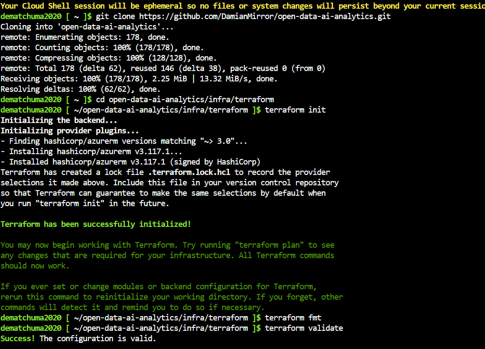
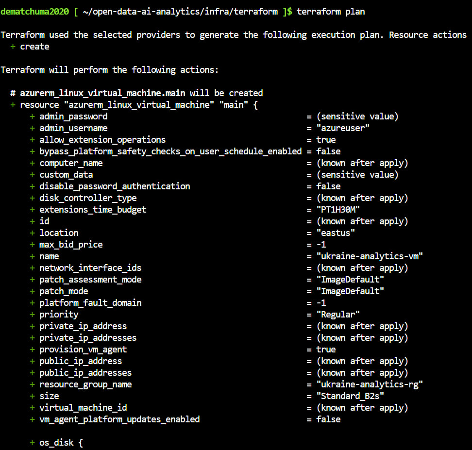
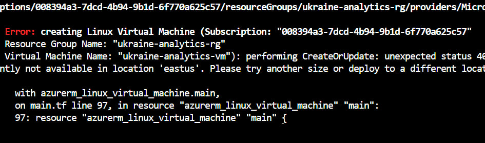
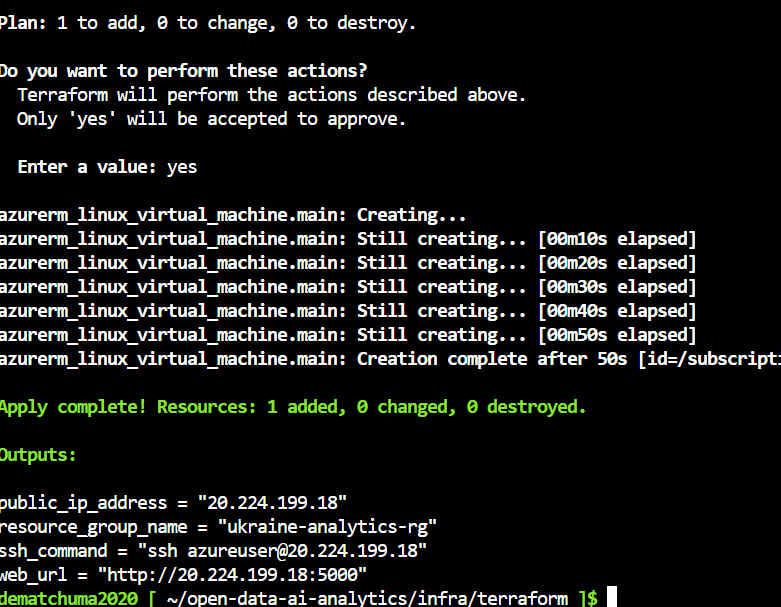
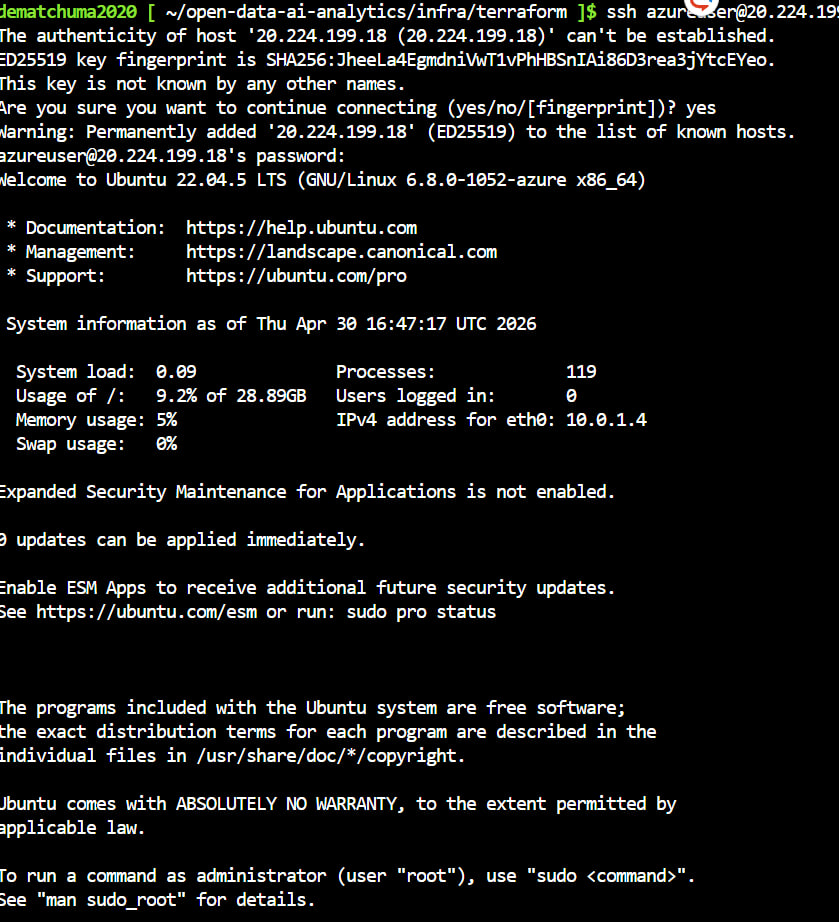
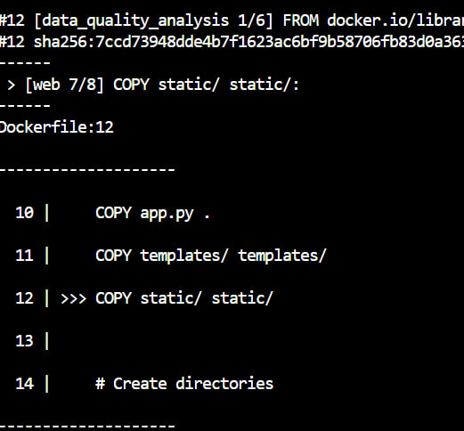
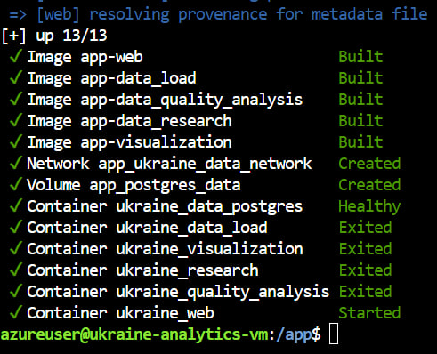
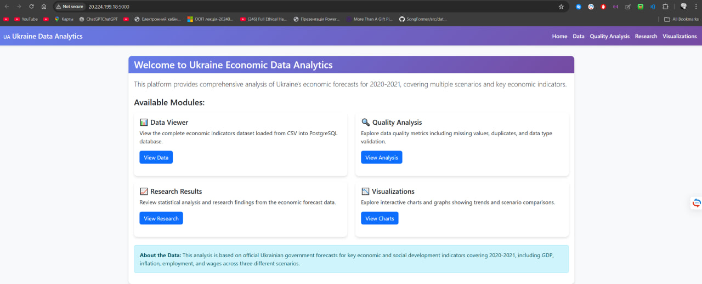
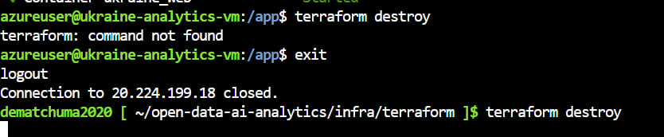

# Лабораторна робота №4
## Інфраструктура як код. Розгортання Docker-проєкту в Microsoft Azure засобами Terraform + Cloud Shell + cloud-init

**Проєкт:** Open Data AI Analytics  
**Дата виконання:** 2026-05-01

---

## Мета роботи

Навчитися:
- працювати з хмарною інфраструктурою без локального середовища розгортання;
- використовувати Azure Cloud Shell як основне робоче середовище;
- створювати ресурси Azure за допомогою Terraform;
- автоматизувати початкове налаштування Linux VM через cloud-init;
- розгортати контейнеризований застосунок у хмарі.

---

## 1. Підготовка Terraform-конфігурації в Azure Cloud Shell

Після відкриття Azure Portal було запущено Cloud Shell (Bash). У Cloud Shell виконано клонування репозиторію та ініціалізацію Terraform:

```bash
git clone https://github.com/DamianMirror/open-data-ai-analytics.git
cd open-data-ai-analytics/infra/terraform
terraform init
terraform fmt
terraform validate
```

**Скріншот 1 — git clone, terraform init, fmt, validate:**



Terraform успішно ініціалізовано. Провайдер `hashicorp/azurerm v3.117.1` встановлено. Команда `terraform validate` повернула: `Success! The configuration is valid.`

---

## 2. Планування інфраструктури (terraform plan)

Виконано команду `terraform plan` для перегляду ресурсів, які будуть створені:

```bash
terraform plan
```

**Скріншот 2 — terraform plan (план створення VM):**



План показав створення `azurerm_linux_virtual_machine` з параметрами:
- `admin_username = "azureuser"`
- `name = "ukraine-analytics-vm"`
- `resource_group_name = "ukraine-analytics-rg"`

---

## 3. Вирішення проблеми з доступністю VM-розміру

Під час першого `terraform apply` виникла помилка — розмір `Standard_B2s` недоступний в регіоні `eastus`:

**Скріншот 3 — помилка SkuNotAvailable:**



**Вирішення:** За допомогою команди `az vm list-skus` знайдено доступний розмір `Standard_D2s_v6` в регіоні `West Europe`. Оновлено `variables.tf` та перезапущено `terraform apply`.

---

## 4. Успішне розгортання інфраструктури (terraform apply)

Після зміни розміру VM та регіону виконано повторний `terraform apply`:

**Скріншот 4 — terraform apply: VM створена успішно:**



```
Apply complete! Resources: 1 added, 0 changed, 0 destroyed.

Outputs:
public_ip_address = "20.224.199.18"
resource_group_name = "ukraine-analytics-rg"
ssh_command = "ssh azureuser@20.224.199.18"
web_url = "http://20.224.199.18:5000"
```

Terraform створив наступні ресурси в Azure:
| Ресурс | Назва |
|--------|-------|
| Resource Group | ukraine-analytics-rg |
| Virtual Network | ukraine-analytics-vnet |
| Subnet | ukraine-analytics-subnet |
| Public IP | ukraine-analytics-pip |
| Network Security Group | ukraine-analytics-nsg |
| Network Interface | ukraine-analytics-nic |
| Linux Virtual Machine | ukraine-analytics-vm (Standard_D2s_v6, Ubuntu 22.04) |

---

## 5. Підключення до VM по SSH

Після завершення `terraform apply` виконано підключення до VM:

```bash
ssh azureuser@20.224.199.18
```

**Скріншот 5 — SSH підключення до Ubuntu VM:**



VM успішно запущена: Ubuntu 22.04.5 LTS, System load: 0.09, Memory usage: 5%.

---

## 6. Вирішення помилки Docker build

При першому запуску docker compose через cloud-init виникла помилка — порожня директорія `web/static/` не потрапила в git:

**Скріншот 6 — помилка COPY static/:**



**Вирішення:** Прибрано рядок `COPY static/ static/` з `web/Dockerfile`, зміни запушено в GitHub. На VM виконано:
```bash
sudo git pull
sudo docker compose up -d --build
```

---

## 7. Успішний запуск всіх контейнерів

Після виправлення всі 13 сервісів успішно зібрані та запущені:

**Скріншот 7 — docker compose up: всі контейнери запущені:**



Запущені контейнери:
- `ukraine_data_postgres` — Healthy
- `ukraine_data_load` — Exited (завершив завдання)
- `ukraine_visualization` — Exited (завершив завдання)
- `ukraine_research` — Exited (завершив завдання)
- `ukraine_quality_analysis` — Exited (завершив завдання)
- `ukraine_web` — Started

---

## 8. Перевірка роботи веб-інтерфейсу

Відкрито браузер за адресою `http://20.224.199.18:5000`:

**Скріншот 8 — веб-інтерфейс доступний через Public IP:**



Веб-інтерфейс "Ukraine Economic Data Analytics" успішно відкрився в браузері. Доступні модулі: Data Viewer, Quality Analysis, Research Results, Visualizations.

---

## 9. Видалення інфраструктури

Після демонстрації виконано `terraform destroy` для видалення всіх ресурсів та економії Azure-кредиту:

**Скріншот 9 — terraform destroy:**



```bash
terraform destroy
```

---

## Структура Terraform-конфігурації

```
infra/terraform/
├── main.tf          # Опис 7 Azure-ресурсів
├── variables.tf     # Змінні (регіон, розмір VM, порти)
├── outputs.tf       # Виводи (public IP, web URL, SSH команда)
└── cloud-init.yaml  # Скрипт автоналаштування VM
```

### Що робить cloud-init.yaml

1. Оновлення пакетів (`package_update`, `package_upgrade`)
2. Встановлення Docker та Docker Compose plugin
3. Запуск і увімкнення Docker service
4. Додавання `azureuser` до групи `docker`
5. `git clone` репозиторію в `/app`
6. `docker compose up -d --build`

---

## Висновки

В результаті виконання лабораторної роботи:

- Створено повну Terraform-конфігурацію для розгортання в Azure
- Автоматизовано налаштування Linux VM через cloud-init
- Docker-проєкт успішно розгорнуто в хмарі без ручного втручання
- Веб-інтерфейс доступний через публічну IP-адресу
- Після демонстрації інфраструктуру видалено командою `terraform destroy`

**Відкриті порти в NSG:**
- 22 — SSH
- 5000 — веб-інтерфейс Flask
