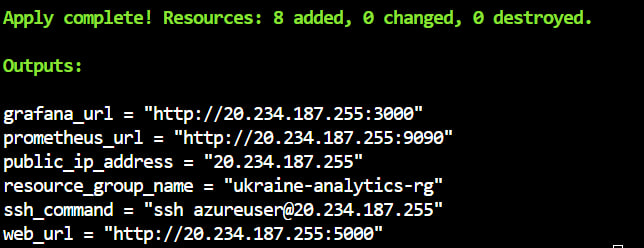
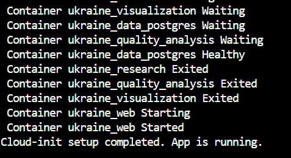
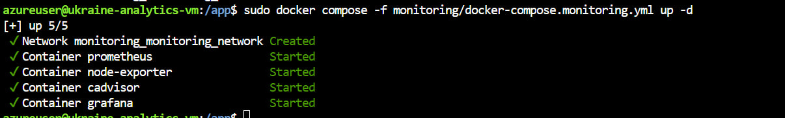
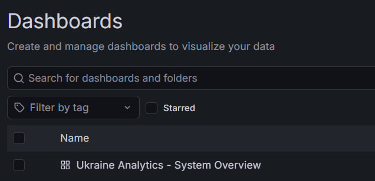
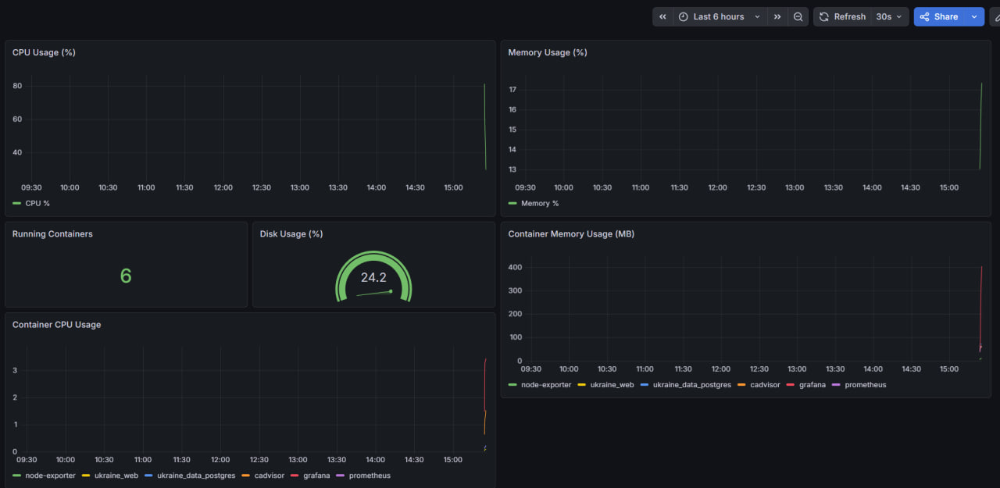
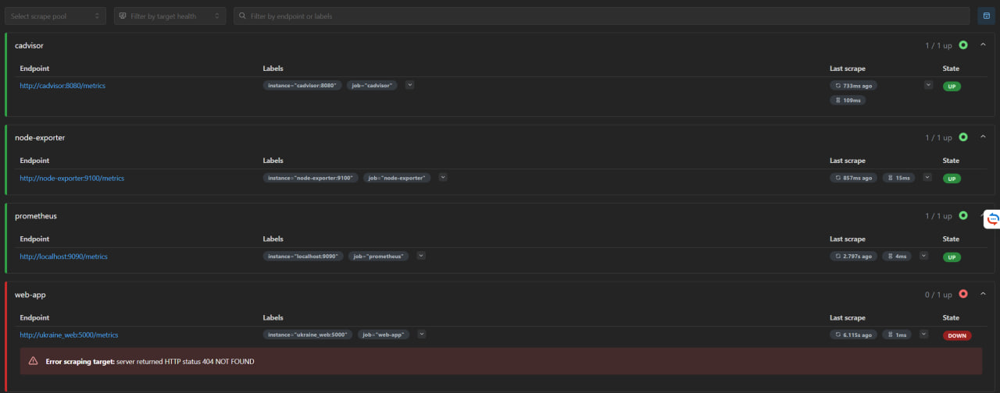

# Лабораторна робота №5
## Моніторинг за допомогою Prometheus та Grafana

**Проєкт:** Open Data AI Analytics  
**Дата виконання:** 2026-05-01

---

## Мета роботи

Навчитися:
- організовувати базовий моніторинг розгорнутого застосунку;
- збирати метрики з сервера, контейнерів і застосунку;
- налаштовувати Prometheus для збору метрик;
- використовувати Grafana для побудови дашбордів;
- аналізувати стан інфраструктури й сервісів на основі метрик.

---

## 1. Розгортання оновленої інфраструктури в Azure

Terraform-конфігурацію оновлено — додано відкриття портів для Grafana (3000) та Prometheus (9090) в Network Security Group. Виконано `terraform apply`:

**Скріншот 1 — terraform apply: оновлені outputs з URL моніторингу:**



```
Apply complete! Resources: 8 added, 0 changed, 0 destroyed.

Outputs:
grafana_url     = "http://20.234.187.255:3000"
prometheus_url  = "http://20.234.187.255:9090"
public_ip_address = "20.234.187.255"
ssh_command     = "ssh azureuser@20.234.187.255"
web_url         = "http://20.234.187.255:5000"
```

---

## 2. Автоматичний запуск застосунку через cloud-init

Після створення VM cloud-init автоматично встановив Docker та запустив усі контейнери:

**Скріншот 2 — cloud-init завершив роботу, контейнери запущені:**



```
Container ukraine_web Started
Cloud-init setup completed. App is running.
```

---

## 3. Запуск стеку моніторингу

Підключившись до VM по SSH, запущено окремий Docker Compose файл для моніторингу:

```bash
cd /app
sudo docker compose -f monitoring/docker-compose.monitoring.yml up -d
```

**Скріншот 3 — запуск 5 контейнерів моніторингу:**



```
✔ Network monitoring_monitoring_network  Created
✔ Container prometheus                   Started
✔ Container node-exporter               Started
✔ Container cadvisor                    Started
✔ Container grafana                     Started
```

### Архітектура моніторингу

```
monitoring/
├── prometheus/
│   └── prometheus.yml              # Конфігурація scrape targets
├── grafana/
│   ├── provisioning/
│   │   ├── datasources/
│   │   │   └── prometheus.yml      # Автопідключення Prometheus
│   │   └── dashboards/
│   │       └── dashboard.yml       # Провайдер дашбордів
│   └── dashboards/
│       └── system-overview.json    # JSON дашборду
└── docker-compose.monitoring.yml   # Оркестрація сервісів
```

### Сервіси моніторингу

| Контейнер | Образ | Призначення | Порт |
|-----------|-------|-------------|------|
| prometheus | prom/prometheus | Збір та зберігання метрик | 9090 |
| grafana | grafana/grafana | Візуалізація метрик | 3000 |
| node-exporter | prom/node-exporter | Метрики Linux VM (CPU, RAM, disk) | 9100 |
| cadvisor | gcr.io/cadvisor/cadvisor | Метрики Docker-контейнерів | 8080 |

---

## 4. Вхід до Grafana

Відкрито браузер за адресою `http://20.234.187.255:3000`. Виконано вхід:

**Скріншот 4 — сторінка входу Grafana:**


- Логін: `admin`
- Пароль: `admin`

Grafana автоматично налаштована через provisioning — Prometheus підключено як datasource без ручного налаштування.

---

## 5. Список дашбордів

Після входу в Grafana автоматично доступний попередньо створений дашборд:

**Скріншот 5 — список дашбордів Grafana:**



Дашборд **"Ukraine Analytics - System Overview"** створено автоматично через provisioning з файлу `monitoring/grafana/dashboards/system-overview.json`.

---

## 6. Дашборд з метриками системи

**Скріншот 6 — дашборд з панелями моніторингу:**



Дашборд містить наступні панелі:

| Панель | Метрика | Значення |
|--------|---------|---------|
| CPU Usage (%) | `node_cpu_seconds_total` | графік у часі |
| Memory Usage (%) | `node_memory_MemAvailable_bytes` | графік у часі |
| Running Containers | `container_last_seen` | **6** контейнерів |
| Disk Usage (%) | `node_filesystem_avail_bytes` | **24.2%** |
| Container CPU Usage | `container_cpu_usage_seconds_total` | по кожному контейнеру |
| Container Memory Usage (MB) | `container_memory_usage_bytes` | node-exporter, ukraine_web, postgres, cadvisor, grafana, prometheus |

Оновлення дашборду відбувається кожні **30 секунд**.

---

## 7. Перевірка Prometheus targets

Відкрито `http://20.234.187.255:9090/targets` для перевірки стану збору метрик:

**Скріншот 7 — Prometheus targets:**



| Job | Endpoint | Стан |
|-----|----------|------|
| cadvisor | http://cadvisor:8080/metrics | ✅ UP |
| node-exporter | http://node-exporter:9100/metrics | ✅ UP |
| prometheus | http://localhost:9090/metrics | ✅ UP |
| web-app | http://ukraine_web:5000/metrics | ❌ DOWN (404) |

**Примітка:** `web-app` має статус DOWN, оскільки Flask-застосунок не має ендпоінту `/metrics`. Для трьох основних джерел метрики збираються успішно.

---

## Конфігурація Prometheus (prometheus.yml)

```yaml
global:
  scrape_interval: 15s

scrape_configs:
  - job_name: 'prometheus'
    static_configs:
      - targets: ['localhost:9090']

  - job_name: 'node-exporter'
    static_configs:
      - targets: ['node-exporter:9100']

  - job_name: 'cadvisor'
    static_configs:
      - targets: ['cadvisor:8080']

  - job_name: 'web-app'
    static_configs:
      - targets: ['ukraine_web:5000']
    metrics_path: '/metrics'
```

---

## Відкриті порти в NSG

| Порт | Призначення |
|------|-------------|
| 22 | SSH |
| 5000 | Веб-інтерфейс Flask |
| 3000 | Grafana |
| 9090 | Prometheus |

---

## Висновки

В результаті виконання лабораторної роботи:

- Розгорнуто повний стек моніторингу (Prometheus + Grafana + Node Exporter + cAdvisor) в Docker на Azure VM
- Prometheus збирає метрики з 3 джерел: сам Prometheus, Node Exporter (VM), cAdvisor (контейнери)
- Grafana автоматично підключена до Prometheus через provisioning
- Створено дашборд "Ukraine Analytics - System Overview" з 6 панелями
- Дашборд відображає: CPU VM, пам'ять VM, кількість контейнерів, використання диска, CPU та пам'ять по контейнерах
- Моніторинг дозволяє в реальному часі спостерігати за станом інфраструктури

**Спостереження за результатами моніторингу:**
- CPU навантаження VM мінімальне (менше 5%) — система працює стабільно
- Використання пам'яті ~17% від доступної
- Диск використано на 24.2% з 30GB
- Запущено 6 активних контейнерів моніторингу паралельно з застосунком
